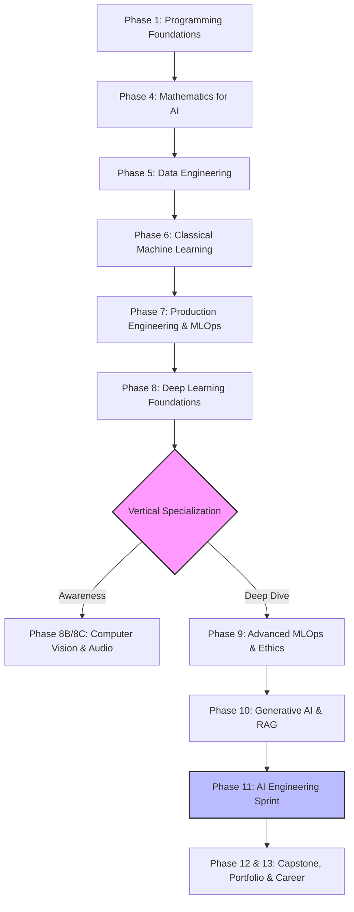

<div align="center">
  <h1>🚀 AI Engineering Roadmap & Portfolio</h1>
  <p><i>From Absolute Beginner to Production-Ready AI Engineer.</i></p>

  [](https://opensource.org/licenses/MIT)
  [](#)
  [](#)
</div>

<br/>

<div align="center">
  
  
</div>

---

## 👤 Executive Summary

**Muhammad Abdurrehman Azam**  
B.Sc. Software Engineering · University of Science & Technology Bannu (USTB)  

This repository serves as the central hub, code portfolio, and audit trail for a ~22–36 month transition into AI Engineering. Built entirely using 220+ free, open-source resources, the curriculum spans fundamental mathematics to advanced LLM orchestration and cloud deployment. 

**Primary Specialization Track:** LLM Application Engineer (Focusing on RAG systems, LLM APIs, AI agents, DSPy prompt optimization, LiteLLM routing, and FastAPI deployment).  
**Target:** AI Engineering roles and M.Sc. program admission in Germany by 2028.

---

## 🗺️ Visual Architecture & Roadmap


---

## 🏗️ Tech Stack

The skills targeted in this roadmap are categorized by their role in the ML lifecycle:

* **Core & Languages:** `Python 3.11` · `SQL`
* **Deep Learning & CV/Audio:** `PyTorch` · `Hugging Face` · `YOLOv8` · `OpenCV` · `Whisper`
* **Generative AI & LLMs:** `LangChain` · `DSPy` · `LiteLLM` · `Pydantic AI` · `Ollama` · `vLLM`
* **Data & MLOps:** `PostgreSQL + pgvector` · `MongoDB` · `Docker` · `MLflow` · `W&B` · `DVC` · `Evidently AI`
* **Testing & Security:** `pytest` · `Great Expectations` · `Deepchecks` · `Presidio (PII)` · `CodeCarbon`
* **Cloud & Infrastructure:** `AWS Bedrock` · `GCP Vertex AI` · `Kubernetes` · `Terraform`

---

## 🛠️ Local Environment Setup

To reproduce the projects and scripts within this repository, ensure Python 3.11+ is installed on your machine.

1. **Clone the repository:**
   ```bash
   git clone [https://github.com/AbdurrehmanAzam/Ai-engineering-roadmap.git](https://github.com/AbdurrehmanAzam/Ai-engineering-roadmap.git)
   cd Ai-engineering-roadmap
   ```

2. **Initialize a virtual environment:**
   ```bash
   python -m venv venv
   ```

3. **Activate the environment:**
   * **Windows:** `.\venv\Scripts\activate`
   * **Mac/Linux:** `source venv/bin/activate`

4. **Install dependencies:**
   ```bash
   pip install -r requirements.txt
   ```

---

## 📅 Curriculum Overview

Detailed daily and weekly progress is tracked transparently in the [Progress Log](progress-log.md). 

| Phase | Core Focus Area | Duration | Status |
| :---: | :--- | :--- | :---: |
| **01** | Programming Foundations (Python, OOP, NumPy, Git) | 5 weeks | 🔄 In Progress |
| **02** | Algorithm Engineering (50 LeetCode problems) | Ongoing | ⬜ Pending |
| **03** | Dev Environment & AI Tools (Linux, SSH, Cursor) | 1 week | ⬜ Pending |
| **04** | Mathematics for AI (Neural Network from scratch) | 10 weeks | ⬜ Pending |
| **05** | Data Engineering (SQL, Pandas, APIs, DVC) | 4 weeks | ⬜ Pending |
| **05B**| Databases for AI (pgvector, MongoDB, S3) | 1 week | ⬜ Pending |
| **06** | Classical Machine Learning (XGBoost, Evaluation, SHAP) | 8 weeks | ⬜ Pending |
| **07** | Production Engineering (FastAPI, Docker, CI/CD, MLflow) | 7 weeks | ⬜ Pending |
| **07B**| ML-Specific Testing (Great Expectations, Deepchecks) | 4 days | ⬜ Pending |
| **08** | Deep Learning (PyTorch, fast.ai, Karpathy Series, HF) | 8 weeks | ⬜ Pending |
| **08B**| Computer Vision (OpenCV, YOLO, Segmentation) | 2 weeks | ⬜ Pending |
| **08C**| Speech & Audio AI (Whisper, TTS, Diarisation) | 1 week | ⬜ Pending |
| **08.5**| Open-Source LLM Deployment (Ollama, vLLM Benchmarking) | 4 days | ⬜ Pending |
| **09** | MLOps (Quantization, Data Drift, W&B Sweeps) | 4 weeks | ⬜ Pending |
| **09B**| Responsible AI & Ethics (Bias Audits, LIME, Presidio PII) | 1 week | ⬜ Pending |
| **09C**| LLM Alignment (RLHF & DPO) | 1 week | ⬜ Pending |
| **09D**| Feature Stores (Feast) | 3 days | ⬜ Pending |
| **10** | Generative AI (LoRA, RAG, ChromaDB, DSPy, Multimodal) | 7 weeks | ⬜ Pending |
| **10B**| Advanced RAG Evaluation (RAGAS, Embeddings, Chunking) | 5 days | ⬜ Pending |
| **11** | AI Engineering Sprint (LiteLLM, Pydantic AI, Agents, Security)| 13 weeks| ⬜ Pending |
| **11B**| Streaming & Infrastructure as Code (Terraform) | 1 week | ⬜ Pending |
| **11C**| Kubernetes & gRPC | 1 week | ⬜ Pending |
| **12** | Interview Preparation (System Design, Certifications) | 1 week | ⬜ Pending |
| **13** | Career & Networking (Freelance, M.Sc. Applications) | Ongoing | ⬜ Pending |

---

## 📁 Repo Structure

    Ai-engineering-roadmap/
    ├── LICENSE
    ├── README.md
    ├── progress-log.md
    ├── requirements.txt
    ├── phase-1-python/
    │   ├── 1.1-fundamentals/
    │   ├── 1.2-oop/
    │   ├── 1.3-numpy-matplotlib/
    │   ├── 1.4-venv-jupyter/
    │   └── 1.5-git-github/
    ├── phase-2-algorithms/           (coming soon)
    ├── phase-3-dev-environment/      (coming soon)
    ├── ...
    ├── projects/
    │   ├── kaggle-runs/
    │   └── capstone/
    └── notes/

---

## 📐 Engineering Methodology

To ensure steady progress and maintain high standards, this repository adheres to the following constraints:

1. **Deliverable-Driven Phase Gates:** No phase is considered complete without a functional, pushed code deliverable.
2. **Open-Source Reliance:** The curriculum is built entirely utilizing free and open-source educational resources.
3. **Transparent Auditing:** Development timelines, including roadblocks and delays, are logged accurately. Honest logging is enforced.
4. **Specialization Focus:** Broad awareness across all AI domains, with deep vertical specialization in NLP/LLMs following Phase 8.
5. **Consistency Protocol:** A minimum weekly commit requirement is strictly enforced, scaling down to a "Minimum Viable Week" (1 LeetCode problem per day) during university exam periods.

---

## 🎯 Key Deliverables

Upon completion, this repository will yield:
- **10+** Production-quality, deployable AI projects. *(GIF demo placeholders will be added here upon completion)*
- **5** Documented Kaggle competition entries.
- **1** Deployed RAG application functioning across 3+ LLM providers via LiteLLM.
- **1** DPO Fine-tuned model hosted on the Hugging Face Hub.
- **5** Complete System Design architectures documented and published.

---

## 📬 Contact & Links

- **GitHub:** [@AbdurrehmanAzam](https://github.com/AbdurrehmanAzam)
- **Email:** abdurrehmanazam300@gmail.com

---

<p align="center"><i>"The best time to start was yesterday. The second best time is now. The third best time will never come."</i></p>